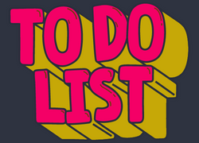
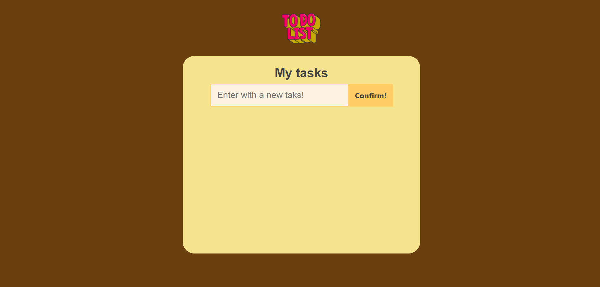
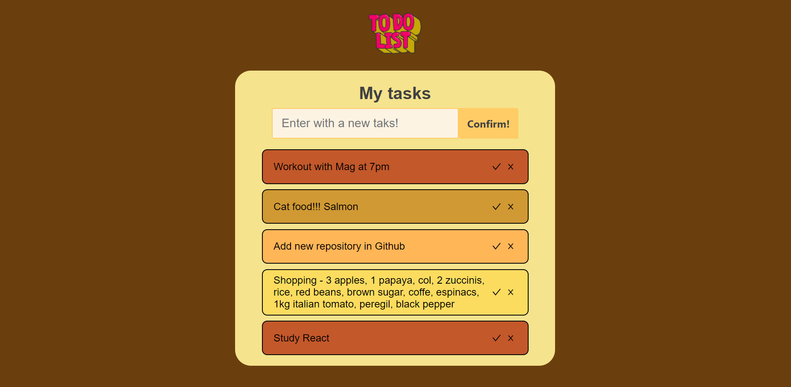
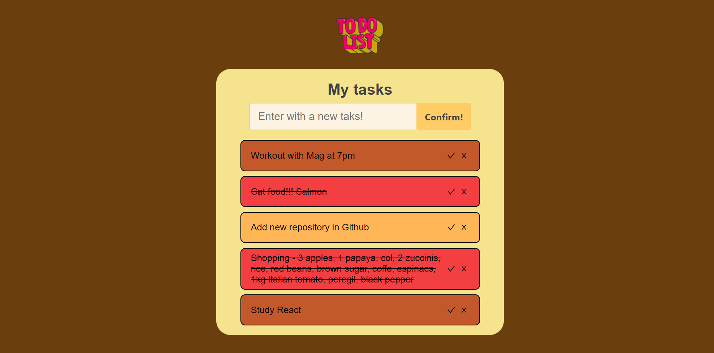
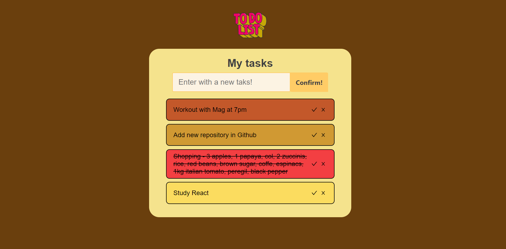

# 
 To-Do List With React 

<strong> Challenge proposed by <strong><a href="https://www.freecodecamp.com/">FreeCodeCamp</a>

  

## 
Overview

  
### 
About the Challenge

Building a To-do list application is going to fundamentals of React Js. It is a starter project that would help solidify basic concepts like State, Components, Virtual DOM, JSX, CSS and UX.  

The requested are:
* A textarea and input form, this part takes care of receiving the task which will be rendered to the to-do list component.
* Management Key and Id to storage the tasks in order (without LocalStorage); 
* Buttons to let *"Complete"* or *"Delete"* the task;
* Each task should be given a different color;
* Every complete task will be given a new color to identificate it;
* UX Design is free to build;
  
### *In the project directory, you can run:*

### `npm start`
***  

## 
Screenshot

 *To-Do List*
  
* I choose the UX with refes from 90' Games and Colors in tons of "tierra" Nude;  
* Enter with your task;
* Clic in "Confirm" to include the task at list;  
  

***
  
*Tasks* 

* Task's design with sequences Nude colors;
* Adaptive Task Component and responsive;
  

  
***  
  
*Task's complete!*
  
* Clic in	":heavy_check_mark:" to let a line through on the selected task;
* Change the backgroung color after complete your task;   
  

 
***
  
*Delete the task!*  
  
* Clic in ":x:" to delete the task;
  
  
  

***  
>## Technology Development

* JSX
* React
* DOM
* JavaScript 
* HTML5 
* CSS3 - Flexbox

>## Author
*Janaina Bazete (My nickname is Nina).*

**We can talk in my <a href="https://www.linkedin.com/in/janainabazete/">LinkedIn</a>**
  
	:shipit:
